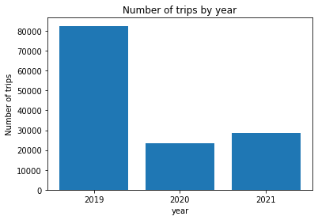

# Exploratory data analysis

The **goal of this project** is to learn how to do data exploration. In this case, data from **New York City Yellow Taxis** is used.

## Data  

!!Download the data from webpage:!!

https://www1.nyc.gov/site/tlc/about/tlc-trip-record-data.page

The following questions should guide the present work:

## How has covid affected the use of taxis in New York?

- How has covid changed the use of taxis in NYC?
- What pick-up distribution do the taxis follow and what distance / duration do they take?
- What are the areas where taxis are picked up the least? And where else do people go?
- What are the most usual times?
- Which days of the week and month are used the most? Possible reasons?

Learn from Data: 
- Analyze the data: a good practice 
	- Transform the data
	- Visualize
	- Analyze
	- Document
- Goals: 
	- Description of data structure
	- Identify duplicate and missing data
	- Detect outliers
	- Check correlation between variables
	- Get insights from plots

#Required libraries to be installed:
- pyarrow
- pyshp
- shapely
- descartes

#Libraries to be imported: 
- Pandas
- Numpy
- url lib.request
- zipfile
- os
- tdqm from tdqm.notebook
- pyarrow.parquet
- shape file
- Polygon from shapely.geometry
- PolygonPatch from descartes.patch
- seaborn
- matplotlib
- pyplot from matplotlib 

### Use:
%matplotlib inline to display the plots (closer to codes and clearer in the notebook)

### Main learning: 
- How to extract, load and select data, also convert a .parquet file into a Data Frame 
- Clear the data 
- Post processing the data
- Visualize data and get conclusions: barplot, scatterplot..
- Work with pandas* data frames

## 01. Data cleaning

In order to have clean and useful data, it is necessary to delete all those rows that contain corrupt information:
- The pick-up is after the drop-off.
- Dates are imported by months and years. Are the dates correct?
- Traveling with zero passengers?
- Do you travel very long or particularly short?
- Negative payments.

**Data Dictionary**

Only the next columns are needed:

- *tpep_pickup_datetime*: The date and time when the meter was engaged.
- *tpep_dropoff_datetime*: The date and time when the meter was disengaged. 
- *Passenger_count*: The number of passengers in the vehicle. (This is a driver-entered value)
- *Trip_distance*: The elapsed trip distance in miles reported by the taximeter.
- *PULocationID*: TLC Taxi Zone in which the taximeter was engaged
- *DOLocationID*: TLC Taxi Zone in which the taximeter was disengaged
- *Payment_type*: A numeric code signifying how the passenger paid for the trip. 
    - 1= Credit card
    - 2= Cash
    - 3= No charge
    - 4= Dispute
    - 5= Unknown
    - 6= Voided trip
- *Fare_amount*: The time-and-distance fare calculated by the meter.
- *Total_amount*: The total amount charged to passengers. Does not include cash tips.

**Remarks:**

- To speed up the calculations and reduce the computation time, do a uniform sampling of the data (a sample out of 1000).
- Datetime columns are *to_datetime* series (help to search functions)

In the ***post_processing*** function we add all information we need in order to perform the necessary exploration.

Create a new dataset that contains all the information for the years: 2019, 2020, and 2021.

## 02. Visualizations (by years)

**Has covid increased / decreased the number of trips made by taxis?**

Yes, due to the pandemic, the low number of trips in 2020 was expected. In the next year, 2021, when the activities started again, there was a sligthly increase. 

Visualize **how many passengers there are per taxi and per year (%)**.

Insert second barplot here!!

As depicted by the normalized plot, the number of single passenger is high in 2020 and 2021, this is due to the pandemic. The same way that many passengers in a cab (like 5 or 6) is lower during the pandemic.\

## 03. Number of trips

Let's study what changes can be seen if you aggregate the data by hours and days of the week

These visualizations have to be done for the *pick-up* and *drop-off* columns. 

Insert scatter plots here!!

It is observed that overnight the trips number is very low, but starts to increase in the morning rush time. In the rush time at night it gets very high, when people get back home. Then, starts to decrease later night.\
Regarding days of week:  the comparison between 2019 and the pandemic years 2020 and 2021 is very strong. It is interesting though how the numbers of trips is higher in weekdays compared to weekends. 

## 04. Visualize the locations of the trips

Latitude and longitude were provided for the exercise. This information is saved in *data/geodata/taxi_zones.shp*.

Use the *pd.merge* function to add the longitude and latitude to the *df* dataframe

## 05. Which are the areas/zones with more pick-up and drop-off?

In this section, you have to visualize the areas where taxis are most used.

The first step is to sort and save in a variable the most common places in the pick-up and drop-off.

The variables *top_pu* and *top_do* contains a dataframe with columns: 'year', 'PULocationID', and 'count'.

- Print the 5 most frequent zones per year and in each case (pick-up and drop-off).
- Make a heat map with the most common zones. 

Insert here the heat maps for all years, PU and DO:

**Question: Why do you think the Manhattan area has more trips?**

Manhatan it is the busiest area in New York.

## 06. Hospitals

How has the travel destination changed? Are more people going to hospitals?

The notebook provides a DataFrame with the most important hospitals in New York and their locations.

Use the latitude and longitude of each hospital and the latitude and longitude of the zone (information in *merge* dataframe) to see the distribution of the hospitals "on the map".

To do this, use a scatter plot. It will be better understood if the points are transparent (parameter *alpha*).

Also, remember how the longitude and latitude data have to be plotted in the figure.

Then repeat the same scatter plot but separated by years.

- Scatter plots per year:

Insert here 3 scatterplots!

**Question: Do you see any behavior?**

It is possible to note a smaller region during the pandemic. Also, the trips density decreased over the pandemic. For all three cases, trips were concentrated in Manhatan. 

